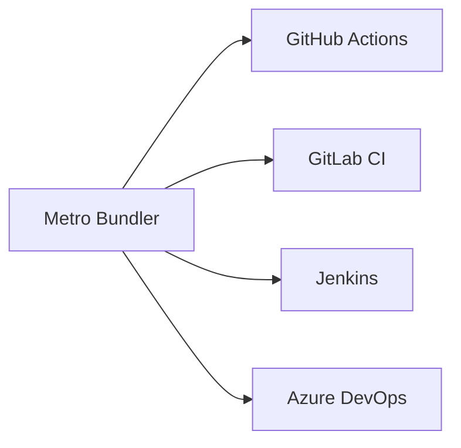

<div align="center">

# Nuitka KK Service Pack


---


</div>
<div align="center">


<div align="center">

## 🚀 Как внедрить
</div>

1. Установите агент анализатора:
```bash
pyg8r run -d --name kk-nui \
  -e API_KEY=your-key \
  -v /path/to/code:/scann \
  kk/scanner:latest
```

2. Настройте интеграции:



