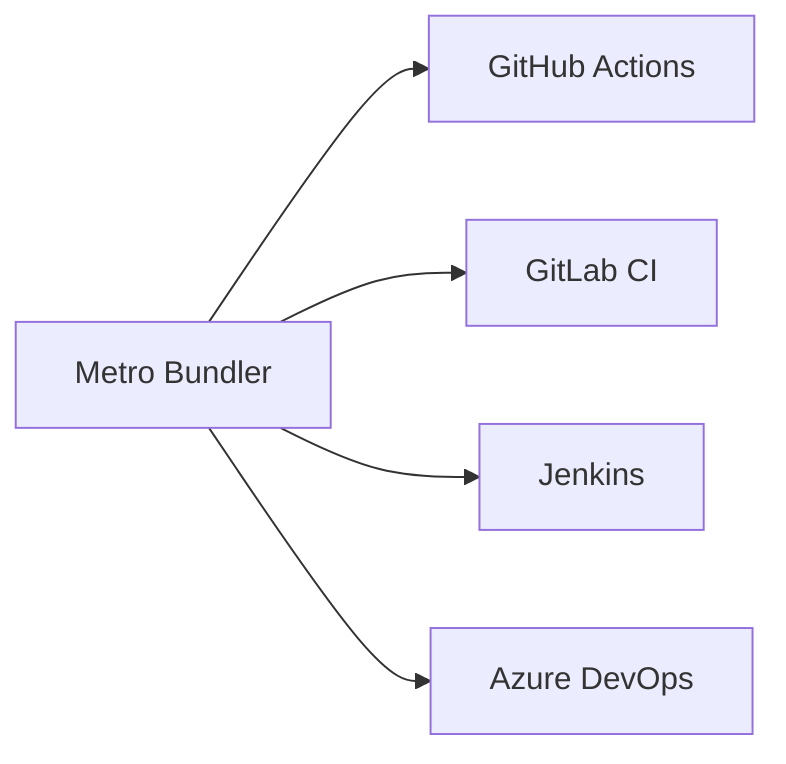

<div align="center">

# Nuitka KK Service Pack


---


</div>
<div align="center">


## 🛠 Технологический стек

</div>

| Компонент       | Технологии                     |
|----------------|-------------------------------|
| Бэкенд         | .NET 6, ASP.NET Core, EF Core |
| Фронтенд       | Tailwind CSS, Alpine.js       |
| Анализатор     | Roslyn, ANTLR, Regex          |
| Инфраструктура | Docker, Kubernetes, Azure     |
| Мониторинг     | Prometheus, Grafana           |

<div align="center">

## 🛡 Защитные механизмы

</div>

1. **Статический анализ кода** (SAST)
   - Поиск инъекций (SQL, OS, Template)
   - Обнаружение hardcoded credentials
   - Анализ зависимостей (SCA)

2. **Динамическая защита** (RASP)
   - Блокировка подозрительных запросов
   - Защита от перебора (rate limiting)
   - Контроль целостности кода

3. **Шифрование данных**
   ```mermaid
   graph LR
       A[Данные] --> B[AES-256]
       B --> C[Хранилище]
       C --> D[Токенизация]
       D --> E[Анонимизация]
   ```
<div align="center">

## 📊 Метрики безопасности
</div>

| Показатель               | Целевое значение |
|-------------------------|-----------------|
| Покрытие кода тестами   | ≥85%            |
| Время реагирования      | <15 мин         |
| False positive rate     | <5%             |
| Критические уязвимости  | 0               |
<div align="center">

# QL7 Bank Server + API
<h2 align="center">🌍 Language / Язык</h2>  
<p align="center">  
  <a href="https://github.com/kiwinatra/QL7-Server/blob/main/_config/rd/README_EN.md" style="text-decoration: none;">  
      
    <span style="font-size: 1.1em; margin-left: 5px; vertical-align: middle;"><strong>English</strong></span>  
  </a>  
  <span style="margin: 0 10px; color: #ccc;">|</span>  
  <a href="https://github.com/kiwinatra/QL7-Server/blob/main/README.md" style="text-decoration: none;">  
      
    <span style="font-size: 1.1em; margin-left: 5px; vertical-align: middle;"><strong>Русский</strong></span>  
  </a>  
</p>  


---


</div>


<div align="center">

## 🚀 Как внедрить
</div>

1. Установите агент анализатора:
```bash
pyg8r run -d --name kk-nui \
  -e API_KEY=your-key \
  -v /path/to/code:/scann \
  kk/scanner:latest
```

2. Настройте интеграции:



